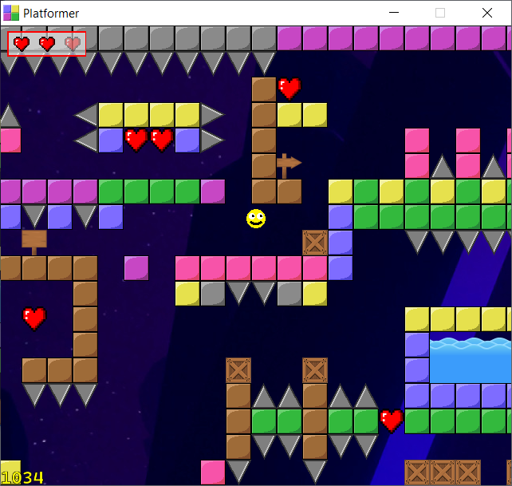
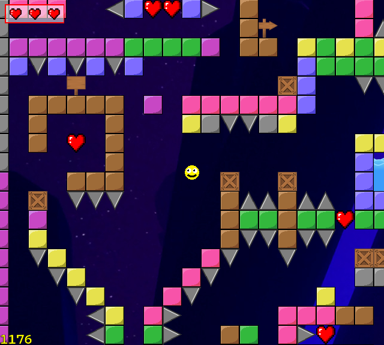
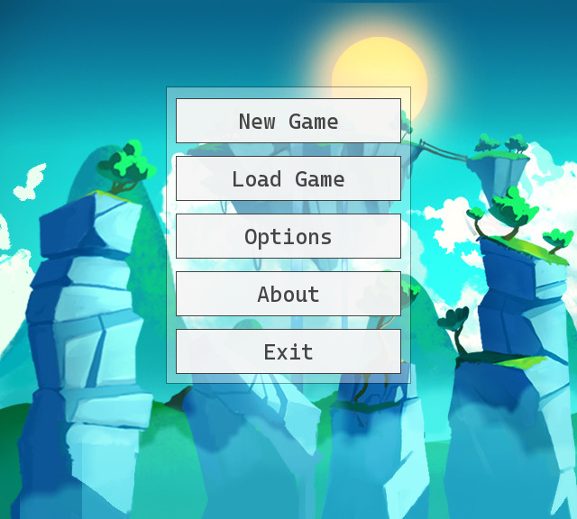
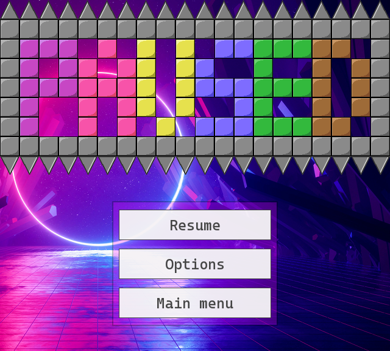
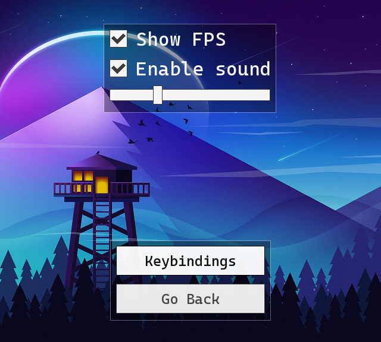
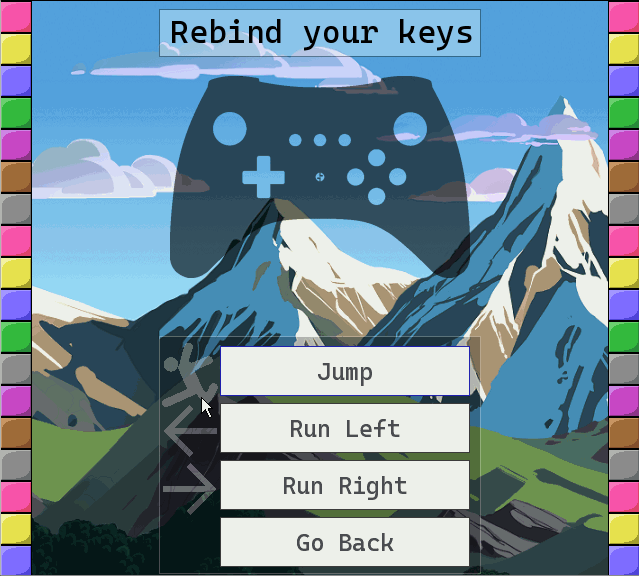
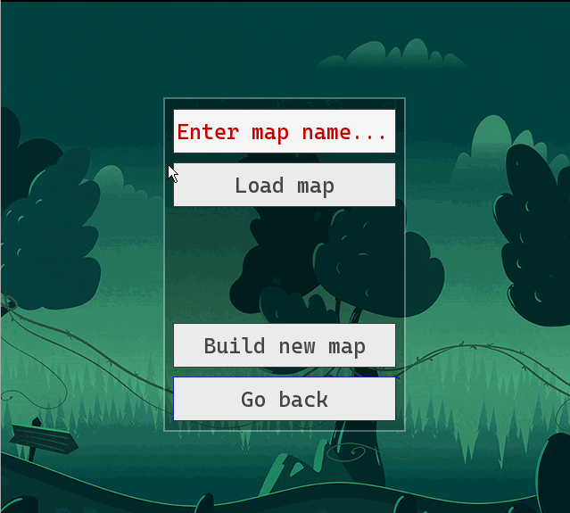
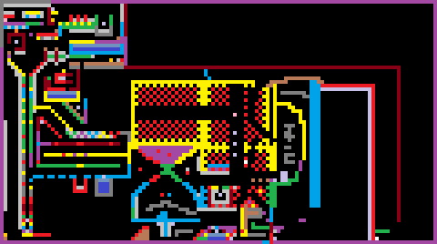
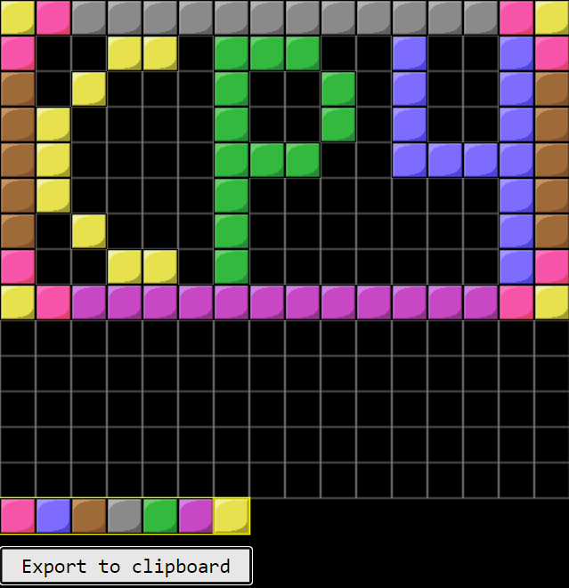

[](https://www.codefactor.io/repository/github/wenox/platformer-2d)
[](LICENSE.md)

#  Platformer 2D

Platformer 2D is a customizable C++20 tile-based game, where you can create your own worlds and alter the settings easily.

The objective for the player is to find an exit in a possibly huge world, without getting himself killed.

## Preview





### Main Menu



### Paused Menu 



### Options



### Keybindings


### Map Loader



### Exemplary `.bmp` world

 _(scaled 400%)_



The worlds are also loadable from `.txt` files!

### Map builder

Independent JS project _(work in progress)_




## Usage

_todo_

## Installation

The following is a complete installation for MinGW along with all required libraries.

```bash
git clone https://github.com/Wenox/platformer-2d.git
cd platformer-2d
mkdir lib && mkdir test/lib && mkdir build
# <Install SFML into lib/>
# <Install tgui into lib/>
# <Install dynamic SFML and tgui libraries into lib/shared_lib or build/>
# <Install googletest into test/lib/>
cd build
cmake .. -G "MinGW Makefiles"
mingw32-make
```

The project is fully cross-platform. Adjust the installation to your own compiler / environment system.

## Documentation

The game API is fully documented. 

See: [Github pages](https://wenox.github.io/platformer-2d/html/modules.html "Documentation")

## License

This project is licensed under MIT license.
 
Feel free to re-use the game or its independent modules to suit your needs.